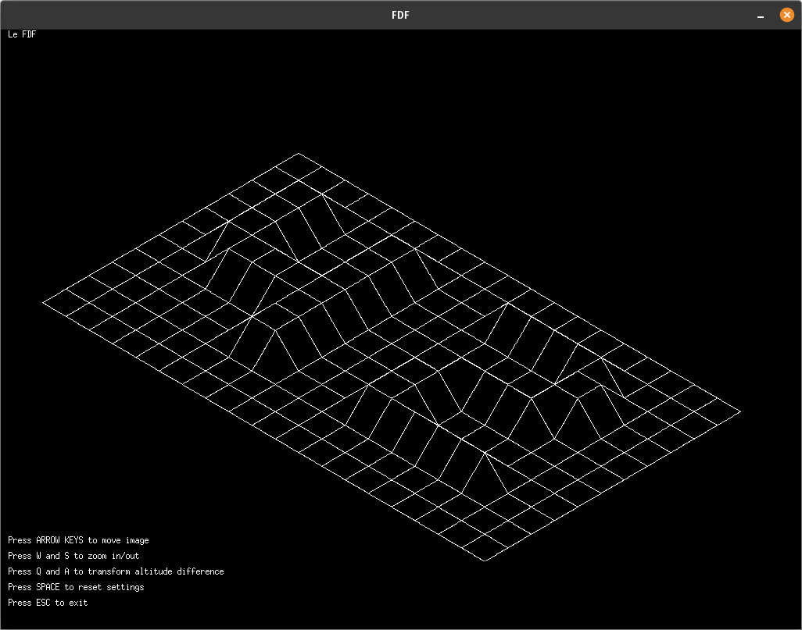

# FdF

FdF (short for 'Fil de Fer', or 'Wireframe' in French) is a simple 3D wireframe renderer written in C. It was my first graphics project at Hive Helsinki, using MinilibX, a simple, low-level graphics library designed for student projects.

## 📚 Usage

FdF renders a 3D wireframe from a heightmap (saved as a `.fdf` file) and allows the user to manipulate the view.

  
*Example rendering of a wireframe grid representing a 3D height map.*

## 📋 Features

- 3D Wireframe Rendering: Visualizes 3D height maps from input files (examples included in `test_maps/` directory)
- 3D Translations: Allows users to move, zoom, and adjust the map's altitude scale.
- Reset View: Quickly revert to default zoom and altitude settings.
- Supports moderately sized maps (tested up to 1000x1000), with performance dropping on larger maps.

## 🛠️ Languages/Tools

- **C**
- **MinilibX**: A simple, low-level graphical library for X-Window (included in the repo)
- **Makefile**: For automated building and dependency management.

## 🚀 Installation

### Prerequisites

- Ensure you have the required dependencies for MinilibX:
  - `sudo apt-get install gcc make xorg libxext-dev libbsd-dev` (for Debian/Ubuntu)

### Building the Project

   ```bash
   git clone https://github.com/yourusername/fdf.git
   cd fdf
   make
   ./fdf [path_to_fdf_file]
   ```

## Controls

- **Arrow Keys**: Move the image
- **W/S**: Zoom in/out
- **Q/A**: Increase/decrease the vertical scale (altitude) of the wireframe.
- **SPACE**: Reset settings
- **ESC**: Exit the program

## ❗ Known Issues

- **macOS**: Due to untested changes, macOS support is currently unavailable.
- **performance drop on larger map**: Performance drops on larger maps; I plan to optimize the map loader in the future.
